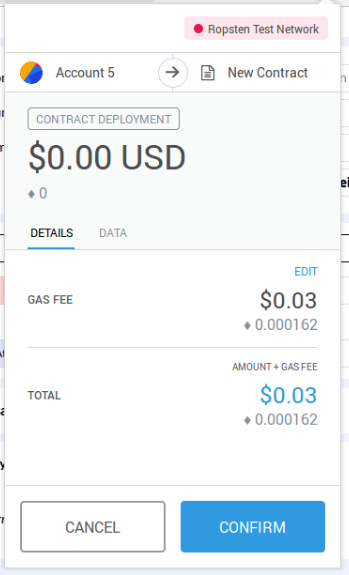
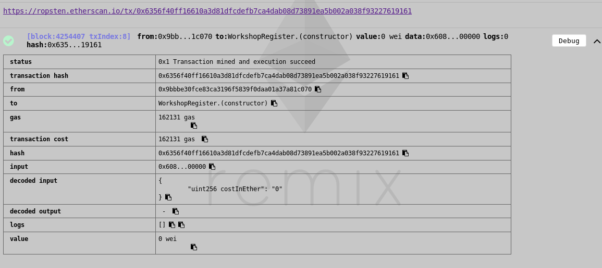
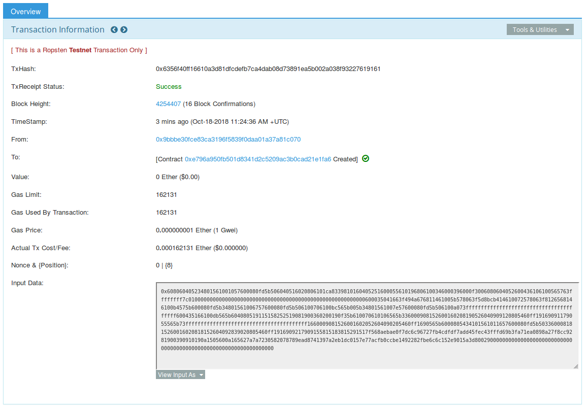
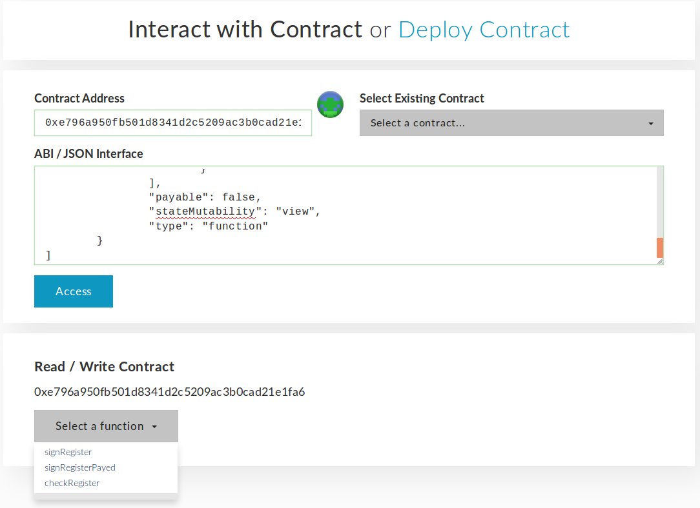

# DApp Workshop

In this workshop we will be taking a quick look at building a DApp, and then we will let you take over and build one yourself. 

The challenge is, in your groups, identify an idea and implement an MVP DApp. Each member of the group must make at least 1 commit to the repo.

The rest of the tutorial will help set up a React DApp with Truffle.
- [React Docs](https://reactjs.org/docs/getting-started.html)
- [Solidity v0.4.24 Docs](https://solidity.readthedocs.io/en/v0.4.24/)

Thanks to [Pet-shop](https://github.com/truffle-box/pet-shop-box) and [react box](https://github.com/truffle-box/react-box).


## How to Use this Box

There are a few technical requirements before we start. Please install the following:

*   [Metamask](https://metamask.io/) - a browser extension Ethereum wallet
*   [Ganache](http://truffleframework.com/ganache) - personal blockchain for Ethereum
*   [Node.js v6+ LTS and npm](https://nodejs.org/en/) - javascript modules
*   [Git](https://git-scm.com/) - version control

Once Ganache is downloaded, start your own local blockchain by simply opening it. You will see several Ethereum accounts with some test Ether that you will use to interact with your contracts.


Once we have those installed, we only need one command to install Truffle:

```shell
npm install -g truffle
```

**Creating a Truffle project using a Truffle Box**

Truffle initializes in the current directory, so first create a directory in your development folder of choice and then moving inside it.

```shell
mkdir CryptoSoc-Workshop

cd CryptoSoc-Workshop
```

We've created a special [Truffle Box](/boxes) just for this tutorial called `truffle-workshop`, which includes the basic project structure as well as code for the user interface. Use the `truffle unbox` command to unpack this Truffle Box. You cn use this as a templates in hackathons or for ideas you may want to try out.

```sh
truffle unbox CryptoSoc/truffle-workshop
```

**Build and Run the App**

Compile and migrate the smart contracts ([Read more about this](#Pet shop)):

```sh
truffle compile
truffle migrate
```

Install the dependencies for the react app and start the server:

```sh
cd client
npm install
npm run start
```

Make sure Metamask is configured to the Ganache network. [See how to here](#set-up-metamask)


## Getting Started

One person can fork this repo: https://github.com/CryptoSoc/truffle-workshop
and give all team members permission to push. Or use the truffle box and set a new remote for it.

If you fork the repo, you will keep more of the git stuff which is probably better, but you must run `cd client && npm run link-contracts` to after compiling the smart contracts. This is automatically done with Truffle.


Send the link to your repo to your team-mates.

Each person should work on a separate branch to avoid a conflict nightmare. You can simply use your name as your branch name.

```
git checkout -b your-branch-name
```

Then when you have coded something:
```
git push -u origin your-branch-name
```

Work together to make something interesting!

### Ideas

A few ideas that might inspire you:

- Cape Town water vouchers.
- Your own token
- Crypto-*insert-animated-object-here*
- Donate to charity
- Bet on the world cup

### The Development Process

- Start by thinking of the problem and how you are going to solve it

- Once your team has decided and agreed, think how the smart contract should look before even beginning coding. 
    - When writing smart contracts, most of your time should be spent on thinking about the contract and not coding it. The code is not long but the possibility for failure is in some ways greater than in regular programs. This is particularly necessary when the contract is financial.
    - More about [smart contract security](https://solidity.readthedocs.io/en/latest/security-considerations.html)

- Start writing the first iteration of your smart contract using [Remix](https://remix.ethereum.org). The compiler assistance is seriously great and it takes no setup.

- Once you have something that more or less works, throw it into truffle and set up a front end to interact with the contract.

- Iterate


### Troubleshooting

#### Compiling or Migrating Contracts

If you get the error when compiling or migrating your contracts:
```
Error: Attempting to run transaction which calls a contract function, but recipient address 0xcaa23447f661e52a0d1fb3c5ab9d743c899721a3 is not a contract address
```

Try delete the contracts folder in the build directory and rerun `compile` and `migrate`.


#### Metamask Transactions Fail with Incorrect Nonce

If Metamask transactions to the contract fail with the error:
```
Error: the transaction doesn't have the correct nonce
```
Disconnect from the Ganache blockchain by connecting to Ropsten. Then reconnect to Ganache. Or go to settings in Metamask and click reset to delete the incorrect history that Metamask has saved.


#### Find Something You're Unfamiliar with?

Look through (or review) the [Pet-Shop tutorial](https://www.truffleframework.com/tutorials/pet-shop).


### Set up MetaMask

From the [Pet Shop tutorial](https://www.truffleframework.com/tutorials/pet-shop)

The easiest way to interact with our dapp in a browser is through [MetaMask](https://metamask.io/), a browser extension for both Chrome and Firefox.

1. Install MetaMask in your browser.

1. Once installed, you'll see the MetaMask fox icon next to your address bar. Click the icon and you'll see this screen appear:

   

1. Click Accept to accept the Privacy Notice.

1. Then you'll see the Terms of Use. Read them, scrolling to the bottom, and then click **Accept** there too.

   

1. Now you'll see the initial MetaMask screen. Click **Import Existing DEN**.

   

1. In the box marked **Wallet Seed**, enter the mnemonic that is displayed in Ganache.

   <p class="alert alert-danger">
   **Warning**: Do not use this mnemonic on the main Ethereum network (mainnet). If you send ETH to any account generated from this mnemonic, you will lose it all!
   </p>

   Enter a password below that and click **OK**.

   

1. Now we need to connect MetaMask to the blockchain created by Ganache. Click the menu that shows "Main Network" and select **Custom RPC**.

   

1. In the box titled "New RPC URL" enter `http://127.0.0.1:7545` and click **Save**.

   

   The network name at the top will switch to say "Private Network".

1. Click the left-pointing arrow next to "Settings" to close out of the page and return to the Accounts page.

   Each account created by Ganache is given 100 ether. You'll notice it's slightly less on the first account because some gas was used when the contract itself was deployed and when the tests were run.

   

   Configuration is now complete.


#### Problems with MetaMask Events

If you want to use events in your front end, Metamask is not currently sufficient - but there is a [bleeding edge solution](https://github.com/MetaMask/metamask-extension/pull/5458) to this which has very recently been merged. If you want to use events before Metamask is updated, try using the [Ethereum browser, Mist](https://github.com/ethereum/mist).

Furthermore, there are some interesting issues with web3 as well, where sometimes things work one way and sometimes another. This seems to happen when changing between my local Ganache and Ropsten and might be explained by the divergent syntax of web3 [0.x.x](https://github.com/ethereum/wiki/wiki/JavaScript-API) and [1.x.x](https://web3js.readthedocs.io/en/1.0/web3-eth.html). 


## Deploying your DApp

We'll look at how to deploy your smart contract to an Ethereum test network, which functions almost the exact same as the Mainnet, and how to connect your front end to it. For this part, we will be using [Heroku](https://www.heroku.com/) and the Ropsten testnet. 

### Deploying your smart contract

Deploying your smart contract is actually fairly easy. You can simply copy the smart contract code into Remix, and inject the Ropsten testnet using Metamask. Then when you click deploy, your smart contract will go live on the Ropsten testnet. Let's see how this works:

#### Claim some Testnet ETH

A testnet is a development environment. That means the ETH you have is worth nothing. If you don't need all of it, donate it back to a faucet. 

To create any transaction on Ethereum, you will need some ETH to cover the gas costs. You can get some free testnet ETH from the links below - you only need 1 ETH.

Don't send lots of transactions. We want you to try get the hang of participating in the Ethereum network and seeing what it's about but there are still maintainers who don't want to see all your spam transactions. In fact Ropsten was already DOS'ed. 

Make sure Metamask is connected to the Ropsten testnet.

Claim some testnet ETH from these faucets:
- https://faucet.metamask.io/
- https://faucet.kyber.network/
- http://faucet.ropsten.be:3001/

#### Head to Remix

Open [Remix](https://remix.ethereum.org) and paste your smart contract in. If you use any other dependencies, you can put them into separate files and import them from you main smart contract.

Compile your smart contract as per usual and go to the `run` tab.

In the `run` tab, change the environment to `Injected Web3`. Make sure you are connected to the Ropsten testnet environment.

Click deploy like before, providing any constructor arguments your smart contract might have.



The transaction will then have to be mined. This can take a little while if the network is busy but will be done within a minute.

Once that is done, you will find the same debug information in the console. 



Additionally there is a link to view the transaction created on the Etherscan block explorer:



Before you continue, you should note down the address of your smart contract so that you don't lose it into the Ether...

Now you can interact with your contract via the usual methods from Remix or any other wallet. For example, you could interact with the contract from [MyEtherWallet](https://www.myetherwallet.com/#contracts)



### Deploying your Front End

To deploy your front end, we will use a simple platform-as-a-service called [Heroku](https://heroku.com). You can create one project for free as a hobbyist so go ahead and create an account.

Uploading your code is fairly simple and acts the same as pushing it to GitHub. 

- [Install the command line tool](https://devcenter.heroku.com/articles/getting-started-with-nodejs#set-up)

- Create the remote application on Heroku. This will add a git remote called `heroku` to your current repo.

```sh
heroku create
```

- Deploy your front end code like you would push to GitHub and start one instance

```sh
cd client/
git add -A
git commit -m "message"

git push heroku master
heroku ps:scale web=1
```

- You can view your app by typing

```sh
heroku open
```

- To update your app, simply commit your latest changes and push them to heroku

```sh
git push heroku master
```

### View the example 

You can view the live demo here: https://floating-everglades-30489.herokuapp.com/

### Procfile

A Procfile is a configuration file for Heroku. For our build, we don't need to specify this as the default for node is to run the application. If you require more complex build options you can add one.

[See here](https://devcenter.heroku.com/articles/procfile)